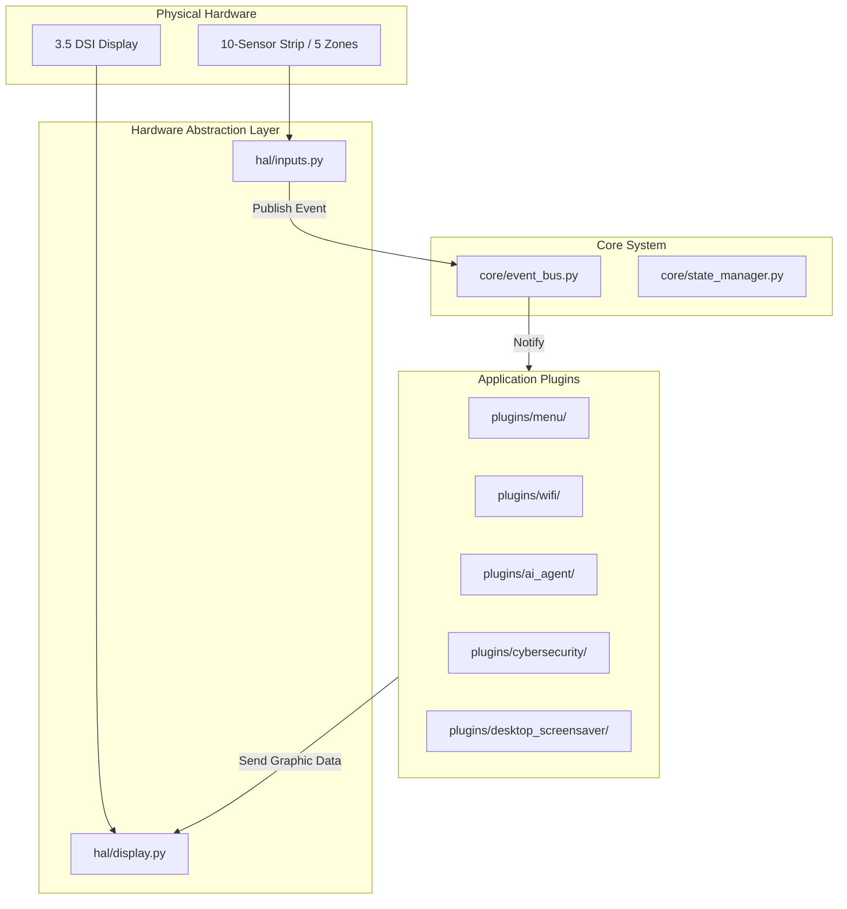
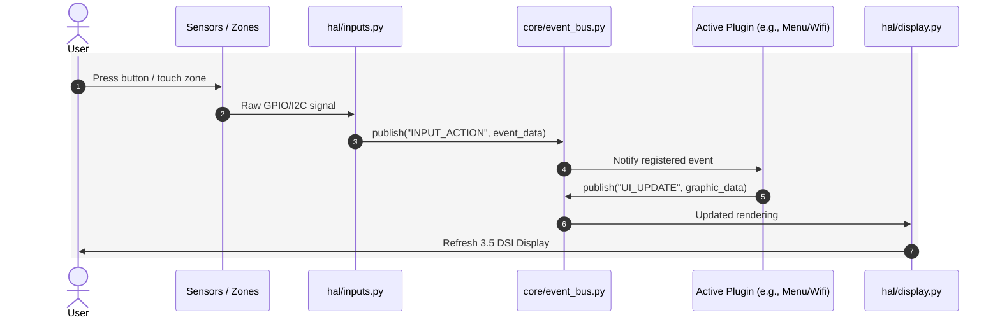

# System Architecture - Standalone Raspberry Pi Project

## 1. Component Diagram

```mermaid
graph TD
    subgraph Hardware [Physical Hardware]
        Display[3.5 DSI Display]
        Strip[10-Sensor Strip / 5 Zones]
    end

    subgraph HAL [Hardware Abstraction Layer]
        HalDisplay[hal/display.py]
        HalInputs[hal/inputs.py]
    end

    subgraph Core [Core System]
        EventBus[core/event_bus.py]
        StateMgr[core/state_manager.py]
    end

    subgraph Plugins [Application Plugins]
        Menu[plugins/menu/]
        Wifi[plugins/wifi/]
        AiAgent[plugins/ai_agent/]
        Cyber[plugins/cybersecurity/]
        Desktop[plugins/desktop_screensaver/]
    end

    Display --> HalDisplay
    Strip --> HalInputs

    HalInputs -->|Publish Event| EventBus
    EventBus -->|Notify| Plugins
    Plugins -->|Send Graphic Data| HalDisplay
```

```mermaid
    sequenceDiagram
    autonumber
    actor User as User
    participant Strip as Sensors / Zones
    participant HalInput as hal/inputs.py
    participant Bus as core/event_bus.py
    participant Plugin as Active Plugin (e.g., Menu/Wifi)
    participant HalDisp as hal/display.py

    rect rgb(245, 245, 245)
        User->>Strip: Press button / touch zone
        Strip->>HalInput: Raw GPIO/I2C signal
        HalInput->>Bus: publish("INPUT_ACTION", event_data)
        Bus->>Plugin: Notify registered event
        Plugin->>Bus: publish("UI_UPDATE", graphic_data)
        Bus->>HalDisp: Updated rendering
        HalDisp->>User: Refresh 3.5 DSI Display
    end
```